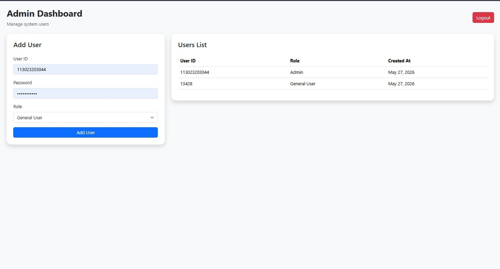
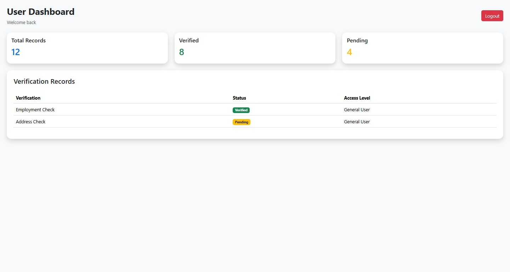

# MPloyChek User Management Portal

## Features
- Role based login
- Admin dashboard
- User dashboard
- Add users
- MongoDB integration
- Secure password hashing using bcrypt
- REST API with Express.js
- Angular frontend
- Vercel deployment

---

## Tech Stack
- Angular
- Node.js
- Express.js
- MongoDB Atlas
- Vercel

---

## Live Demo

Frontend:
https://mploychek-user-management-frontend.vercel.app

Backend:
https://mploychek-user-management-backend.vercel.app/api/users

---

## Test Credentials

### Admin
User ID: 113023203044
Password: shakthi1234

### General User
User ID: 13428
Password: 12345678

## Screenshots

### Login Page

### Admin Dashboard

### User Dashboard

